# 🌱 Spring & Spring Boot Playground

  <b>My hands-on journey into Java Backend Development with Spring, Spring Boot & Microservices.</b>

---

## 🧭 Spring Boot & Microservices Roadmap

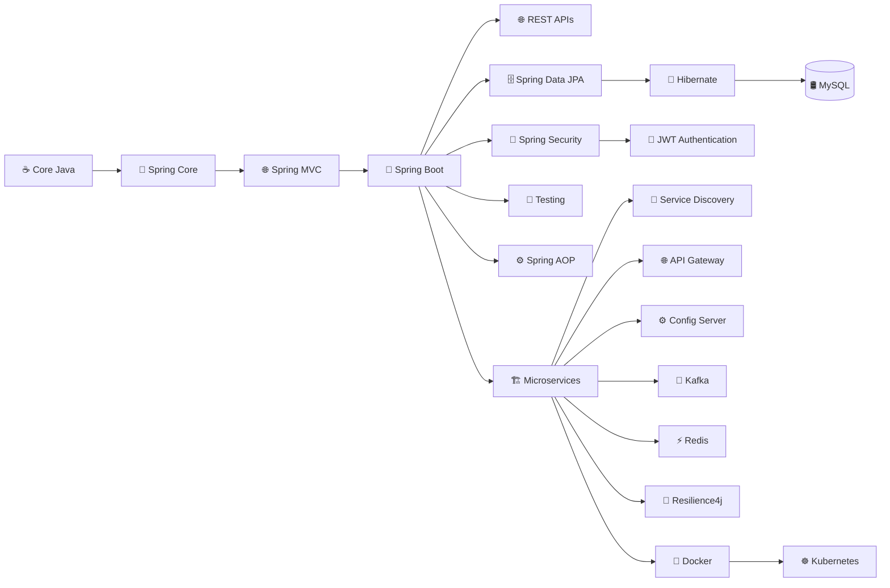

---

## 🏗️ Microservices Architecture

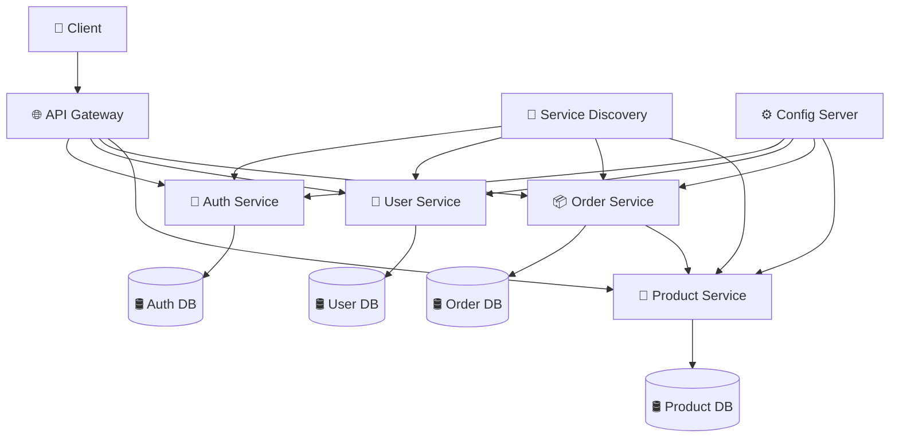

---

## 🔄 Microservices Communication

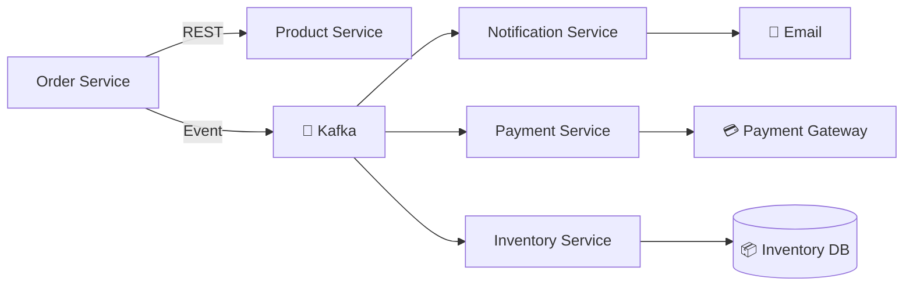

---

## 🌐 API Gateway

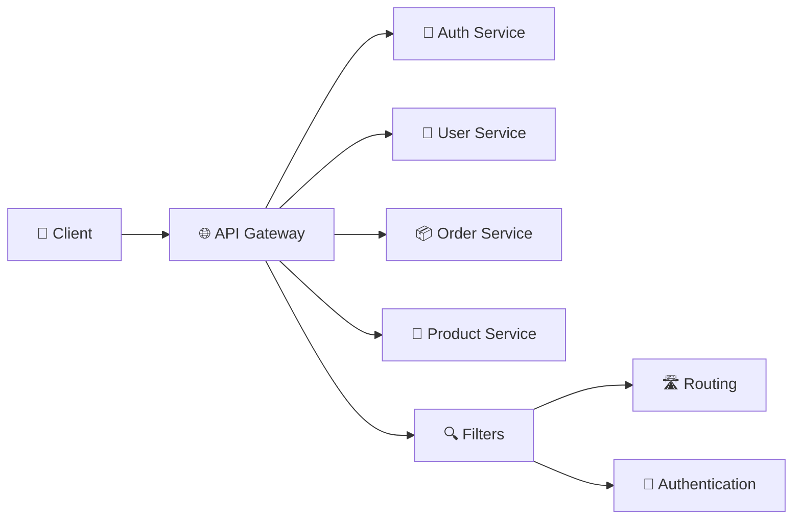

### Topics

* Spring Cloud Gateway
* Routing
* Filters
* Authentication
* Authorization
* Rate Limiting
* Load Balancing

---

## 🔎 Service Discovery

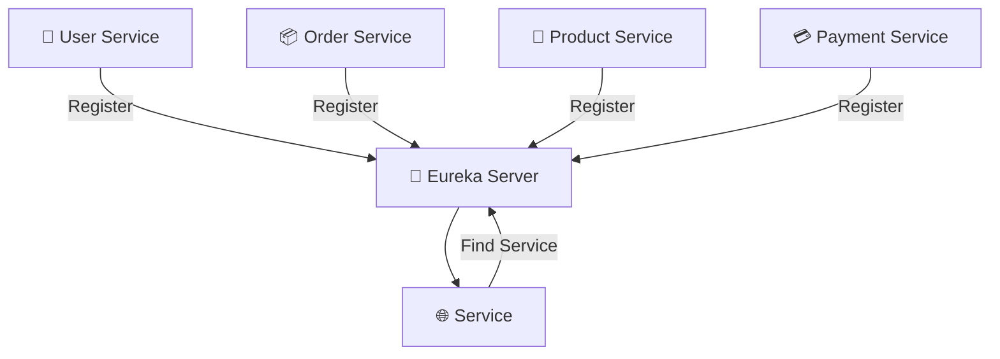

### Topics

* Eureka
* Service Registration
* Service Discovery
* Client-Side Discovery
* Load Balancing

---

## ⚙️ Centralized Configuration

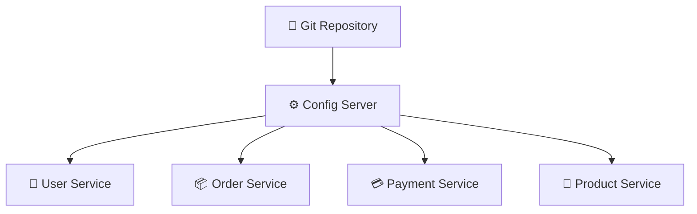

### Topics

* Spring Cloud Config
* Centralized Configuration
* External Configuration
* Environment-specific Configuration

---

## 📨 Event-Driven Architecture

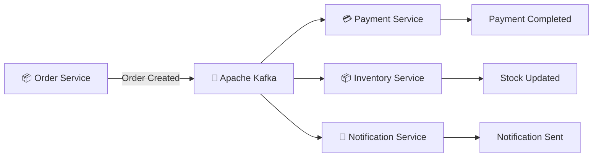

### Topics

* Apache Kafka
* Producers
* Consumers
* Topics
* Partitions
* Consumer Groups
* Events
* Event-Driven Architecture

---

## ⚡ Redis & Caching

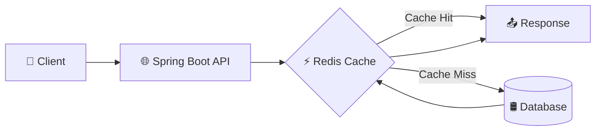

### Topics

* Redis
* Caching
* Cache Hit / Miss
* `@Cacheable`
* `@CachePut`
* `@CacheEvict`
* Distributed Cache

---

## 🛡️ Resilience in Microservices

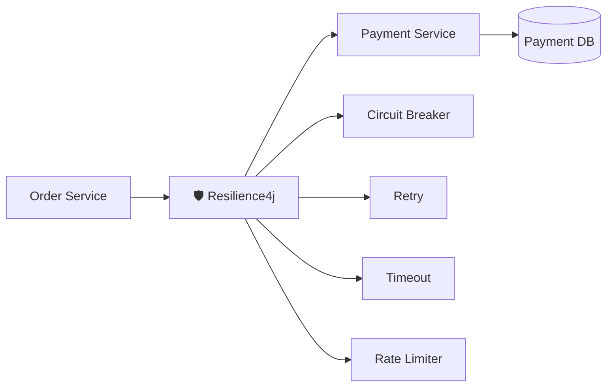

### Topics

* Resilience4j
* Circuit Breaker
* Retry
* Timeout
* Rate Limiting
* Fallback

---

## 🧪 Testing

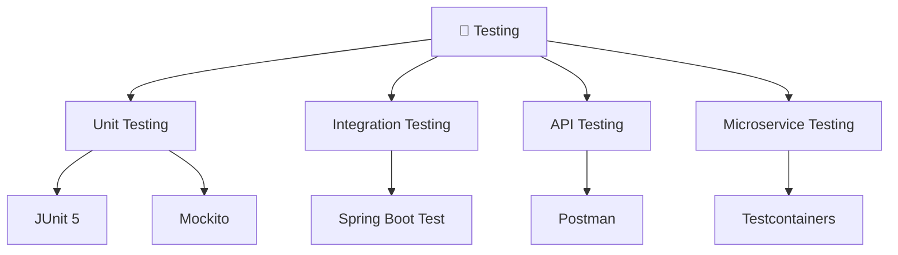

---

## 📚 Technologies I'm Learning

| Category         | Technologies                     |
| ---------------- | -------------------------------- |
| ☕ Language       | Java                             |
| 🌱 Framework     | Spring                           |
| 🚀 Backend       | Spring Boot                      |
| 🌐 API           | REST                             |
| 🗄️ ORM          | JPA, Hibernate                   |
| 🛢️ Database     | MySQL                            |
| 🔐 Security      | Spring Security, JWT             |
| 🏗️ Architecture | Microservices                    |
| 🌐 Gateway       | Spring Cloud Gateway             |
| 🔎 Discovery     | Eureka                           |
| ⚙️ Configuration | Spring Cloud Config              |
| 📨 Messaging     | Apache Kafka                     |
| ⚡ Caching        | Redis                            |
| 🛡️ Resilience   | Resilience4j                     |
| 🧪 Testing       | JUnit 5, Mockito, Testcontainers |
| 📡 API Testing   | Postman                          |
| ⚙️ AOP           | Spring AOP                       |
| 📦 Build Tool    | Maven                            |
| 🐳 Containers    | Docker                           |
| ☸️ Orchestration | Kubernetes                       |

---

## 🎯 My Goal

Build strong backend development skills with **Java + Spring Boot + Microservices** and understand how production-grade distributed systems are designed.

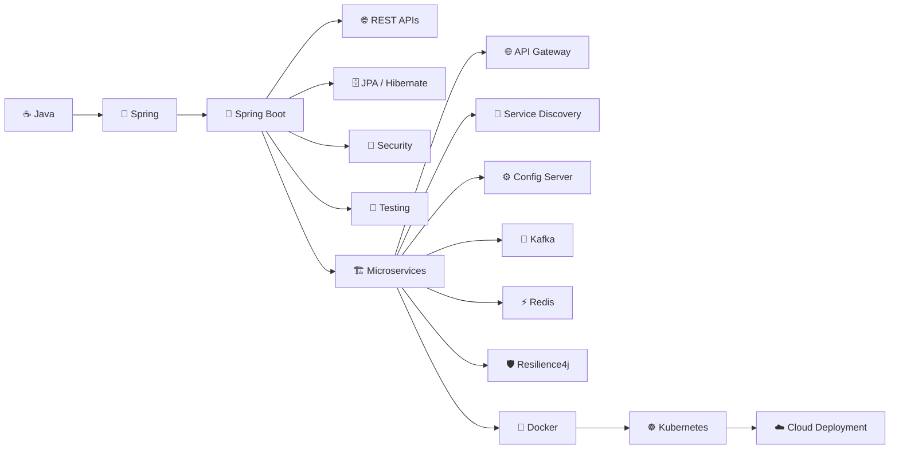

---

## 💡 Learning Philosophy

> **Understand → Code → Debug → Build → Scale**

This repository is my **Spring & Spring Boot playground**, where I practice backend development, JPA/Hibernate, security, REST APIs, microservices, distributed systems, messaging, caching, and production-ready architectures.

---

## ⭐ Keep Building

**Learn the concept. Write the code. Break it. Debug it. Understand it. Build it.**

**Keep learning. Keep coding. Keep building. 🚀**
